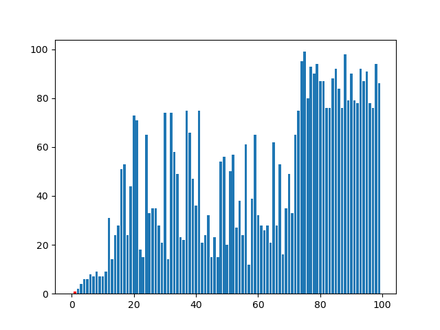

# Basic_Algorithms (naive and pedagogical implementations)

- Add Quicksort with pivot at the end.



- Add Merge Sort with intermediate steps:
```
initial: [50, 65, 99, 87, 74, 63, 76, 100, 5]
merge: [50] [65]
merged as: [50, 65]
-------------------------------------------
merge: [99] [87]
merged as: [87, 99]
-------------------------------------------
merge: [50, 65] [87, 99]
merged as: [50, 65, 87, 99]
-------------------------------------------
merge: [74] [63]
merged as: [63, 74]
-------------------------------------------
merge: [100] [5]
merged as: [5, 100]
-------------------------------------------
merge: [76] [5, 100]
merged as: [5, 76, 100]
-------------------------------------------
merge: [63, 74] [5, 76, 100]
merged as: [5, 63, 74, 76, 100]
-------------------------------------------
merge: [50, 65, 87, 99] [5, 63, 74, 76, 100]
merged as: [5, 50, 63, 65, 74, 76, 87, 99, 100]
-------------------------------------------
final result: [5, 50, 63, 65, 74, 76, 87, 99, 100]
```
- Add Dijkstra's shortest path in a weighted directed graph (the graph is given by a dictionary of dictionaries) from node S to any node in the graph. For example, the shortest path from S to G is given by G <- H <- E <- A <- S.

```
            S    A    B    C    D    E    F    G    H
dist        0    2    6   13   12    5   18   10    9
prev        -    S    E    B    G    A    C    H    E
```
